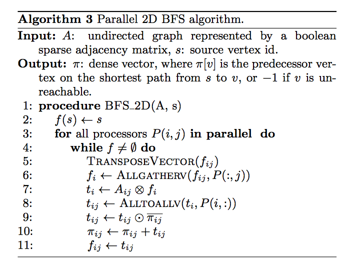

# Compute Centrality using Parallel BFS

## Centrality

[Centrality](https://www.wikiwand.com/en/Centrality) defines how important a vertice in a graph. If one vertice shows
 frequently in shortest path among any other two vertices, it must have high centrality. The computation of 
 centrality is useful in the area of social networks.

## BFS

BFS is a fundamental algorithm in graph theory and attracts much interest in parallel computing. 
We adopted the parallel BFS algorithms in [this paper](https://arxiv.org/pdf/1104.4518.pdf).

## Outline

